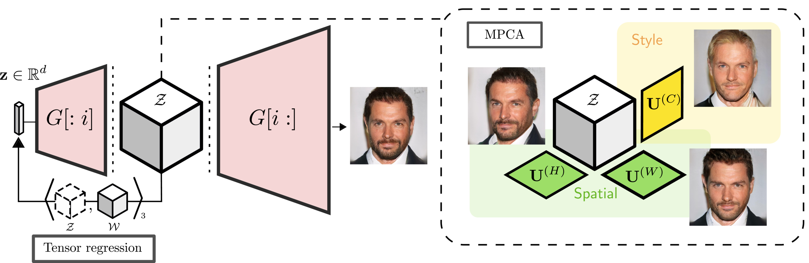
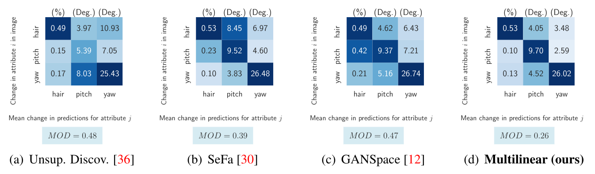
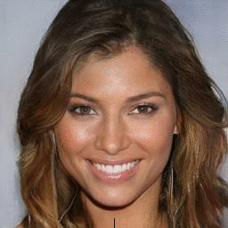

# Tensor Component Analysis for Interpreting the Latent Space of GANs

#### [ [paper](https://arxiv.org/abs/2111.11736) | [project page](http://eecs.qmul.ac.uk/~jo001/TCA-latent-space/) ]

Code to reproduce the results in the paper ["Tensor Component Analysis for Interpreting the Latent Space of GANs"](https://arxiv.org/pdf/2111.11736.pdf).



## dependencies

Firstly, to install the required packages, please run:

````bash
$ pip install -r requirements.txt
````

## Pretrained weights

To replicate the results in the paper, you'll need to first download the pre-trained weights. To do so, simply run this from the command line:

`./download_weights.sh`

# Quantitative results

### building the prediction matrices

To reproduce Fig. 5, one can then run the `./quant.ipynb` notebook using the pre-computed classification scores (please see this notebook for more details).



### manually computing predictions

To call the Microsoft Azure Face API to generate the predictions again from scratch, one can run the shell script in `./quant/classify.sh`. Firstly however, you need to generate our synthetic images to classify, which we detail below.


# Qualitative results

### generating the images

Reproducing the qualitative results (i.e. in Fig. 6) involves generating synthetic faces and 3 edited versions with the 3 attributes of interest (hair colour, yaw, and pitch). To generate these images (which are also used for the quantitative results), simply run:

```bash
$ ./generate_quant_edits.sh
```

### mode-wise edits




Manual edits along individual modes of the tensor are made by calling `main.py` with the `--mode edit_modewise` flag. For example, one can reproduce the images from Fig. 3 with:

```bash
$ python main.py --cp_rank 0 --tucker_ranks "4,4,4,512" --model_name pggan_celebahq1024 --penalty_lam 0.001 --resume_iters 1000
  --n_to_edit 10 \
  --mode edit_modewise \
  --attribute_to_edit male
```

### multilinear edits


Edits achieved with the 'multilinear mixing' are achieved instead by loading the relevant weights and supplying the `--mode edit_multilinear` flag. For example, the images in Fig. 4 are generated with:

```bash
$ python main.py --cp_rank 0 --tucker_ranks "256,4,4,512" --model_name pggan_celebahq1024 --penalty_lam 0.001 --resume_iters 200000
  --n_to_edit 10 \
  --mode edit_multilinear \
  --attribute_to_edit thick
```

# citation

If you find our work useful, please consider citing our paper:

```bibtex
@InProceedings{oldfield2021tca,
  author = {Oldfield, James and Georgopoulos, Markos and Panagakis, Yannis and Nicolaou, Mihalis A. and Ioannis, Patras},
  title = {Tensor Component Analysis for Interpreting the Latent Space of GANs},
  booktitle = {BMVC},
  month = {November},
  year = {2021}
}
```


# contact

**Please feel free to get in touch at**: `j.a.x@qmul.ac.uk`, where `x=oldfield`

--- 

#### credits

All the code in `./architectures/` and `utils.py` is directly imported from [https://github.com/genforce/genforce](https://github.com/genforce/genforce), only lightly modified to support performing the forward pass through the models partially, and returning the intermediate tensors.

The structure of the codebase follows [https://github.com/yunjey/stargan](https://github.com/yunjey/stargan), and hence we use their code as a template to build off. For this reason, you will find small helper functions (e.g. the first few lines of `main.py`) are borrowed from the StarGAN codebase.
